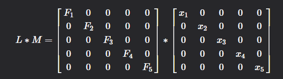

Last weekend, I played UIUCTF 2024 with my team **thefwncrew**. My team finished top 16 in this CTF.


I solved all Cryptography challenges, and 1 misc challenge. Here is my writeup for challenges that are solved by me.

# MISC

## Slot Machine

We have onboard entertainment! Try your luck on our newly installed slot machine.

``ncat --ssl slot-machine.chal.uiuc.tf 1337``

### Downloads
- [chal.py](https://uiuctf-2024-rctf-challenge-uploads.storage.googleapis.com/uploads/7b0918d4a7d18e34f068eac99f1e97d6aef31a8ed9689a7897b115e9514bfd66/chal.py)

### Solution

This challenge asks me for a hex string such that it has longest prefix collision in SHA256

```python
hash = sha256(bytes.fromhex(lucky_number)[::-1]).digest()[::-1].hex()

length = min(32, int(input("How lucky are you feeling today? Enter the number of slots: ")))

if len(set(hash[:length])) == 1:
    print("Congratulations! You've won:")
    flag = open("flag.txt").read()
    print(flag[:min(len(flag), length)])
else:
    print("Better luck next time!")
```

Then I found the site: https://crypto.stackexchange.com/questions/110956/what-s-the-smallest-known-sha256-hash-that-was-ever-produced and its hash is ``0000000000000000000000005d6f06154c8685146aa7bc3dc9843876c9cefd0f``

After that you can use this command to find the block
https://github.com/sylvainpelissier/bitcoinhash
```bash
python3 bitcoinHash.py -v -u  https://blockchain.info/rawblock/0000000000000000000000005d6f06154c8685146aa7bc3dc9843876c9cefd0f

f5b209498bfad650eb000b1917fc119b601e799c18c00b6e562e71300ed1cc93
0ffdcec9763884c93dbca76a1485864c15066f5d000000000000000000000000
```

```python
from pwn import *

io = process(["ncat", "--ssl", "slot-machine.chal.uiuc.tf", "1337"])

test = "f5b209498bfad650eb000b1917fc119b601e799c18c00b6e562e71300ed1cc93"
test = bytes.fromhex(test)[::-1]

io.sendlineafter(b"number: ", test.hex().encode())
io.sendlineafter(b"slots: ", b"24")
io.interactive()
```

### FLAG
```
uiuctf{keep_going!_3cyd}
```


# Cryptography

## X Marked the Spot

A perfect first challenge for beginners. Who said pirates can't ride trains...

### Downloads
- [public.py](https://uiuctf-2024-rctf-challenge-uploads.storage.googleapis.com/uploads/9122a5606d14d1ded3cbd5907af07c55f80db318f0ea761c16531d0327acd09b/public.py)
- [ct](https://uiuctf-2024-rctf-challenge-uploads.storage.googleapis.com/uploads/150449f10624289342a0f5b2d427b3c09eda679b84c5062def1eccf114bdb505/ct)

### Solution

Simple xor problem so i just put my script here.

```python
from pwn import *

from Crypto.Util.number import *

ct = open("ct", "rb").read()
test = b"uiuctf{"
key = xor(ct, test)[:7] + xor(b'}', ct[-1])

print(xor(key, ct))
```

### FLAG
```
uiuctf{n0t_ju5t_th3_st4rt_but_4l50_th3_3nd!!!!!}
```

## Without a Trace

Gone with the wind, can you find my flag?

``ncat --ssl without-a-trace.chal.uiuc.tf 1337``

### Downloads
- [server.py](https://uiuctf-2024-rctf-challenge-uploads.storage.googleapis.com/uploads/c17ae894b0920b181b2d753a693fc678e6d0806045e3d7ba6519111dce60898b/server.py)

### Solution

This challege encodes FLAG into a 5x5 matrix (L).
```python
f = [bytes_to_long(bytes(FLAG[5 * i: 5 * (i + 1)], 'utf-8')) for i in range(5)]
F = [ 
    [0, 0, 0, 0, 0],
    [0, 0, 0, 0, 0],
    [0, 0, 0, 0, 0],
    [0, 0, 0, 0, 0],
    [0, 0, 0, 0, 0],
]
for i in range(5):
    F[i][i] = f[i]
```

Then it takes L times M which is a 5x5 matrix which input being the data we choose.

```python
def inputs():
    print("[WAT] Define diag(u1, u2, u3. u4, u5)")
    M = [
        [0, 0, 0, 0, 0],
        [0, 0, 0, 0, 0],
        [0, 0, 0, 0, 0],
        [0, 0, 0, 0, 0],
        [0, 0, 0, 0, 0],
    ]
    for i in range(5):
        try:
            M[i][i] = int(input(f"[WAT] u{i + 1} = "))
        except:
            return None
    return M
```

The data we choose must match the challenge's conditions.
```python
def check(M):
    def sign(sigma):
        l = 0
        for i in range(5):
            for j in range(i + 1, 5):
                if sigma[i] > sigma[j]:
                    l += 1
        return (-1)**l

    res = 0
    for sigma in permutations([0,1,2,3,4]):
        curr = 1
        for i in range(5):
            curr *= M[sigma[i]][i]
        res += sign(sigma) * curr
    return res

 if check(M) == 0:
    print("[WAT] It's not going to be that easy...")
    return
```

Finally, Challenge returns us the diagonal sum of the matrix L * M.

Basically, we know that 



And we are received $$F_{1}x_{1} + F_{2}x_{2} + F_{3}x_{3} + F_{4}x_{4} + F_{5}x_{5}$$
 
If we have 5 equations like that, we can recover FLAG

```python
from sage.all import *
from Crypto.Util.number import *

M = Matrix([[2, 1, 1, 1, 1], [1, 2, 1, 1, 1], [1, 1, 2, 1, 1], [1, 1, 1, 2, 1], [1, 1, 1, 1, 2]])

M = M.inverse()

res = Matrix([2504408575853, 2440285994541, 2426159182680, 2163980646766, 2465934208374])

res = res * M
FLAG = b""
for i in res[0]:
    FLAG += long_to_bytes(int(i))

print(FLAG)
```
### FLAG
```
uiuctf{tr4c1ng_&&_mult5!}
```

## Determined

"It is my experience that proofs involving matrices can be shortened by 50% if one throws the matrices out."

### Downloads
- [server.py](https://uiuctf-2024-rctf-challenge-uploads.storage.googleapis.com/uploads/7eca7b6525ba52d872109a5296ec74f3a4e58df6c534bfc5f3b54db0a83413f4/server.py)
- [gen.txt](https://uiuctf-2024-rctf-challenge-uploads.storage.googleapis.com/uploads/abd71bfb434d295415aed9b5f1f3cd5d84652605cf272461c83ed0b09160bafd/gen.txt)
- [gen.py](https://uiuctf-2024-rctf-challenge-uploads.storage.googleapis.com/uploads/d0be34e73989114ae65eadcf8c1c7a16770c17cfe293e9d12245ecaf54cbac30/gen.py)

### Solution

In sagemath, we can use symbolic to guess the output of the function.

I use $$p, q, r$$ are variables and after some tries, I choose 0 for the first row and 1 for others. Then the server will give me $$p * q - p * r$$

```python
from sage.all import *
from Crypto.Util.number import *

test = 69143703864818353130371867063903344721913499237213762852365448402106351546379534901008421404055139746270928626550203483668654060066917995961156948563756763620082694010964627379305998217766380375890208111586340805642016329892173840181871705216180866148524640933007104761115889694872164169659985765092765835334
n = 158794636700752922781275926476194117856757725604680390949164778150869764326023702391967976086363365534718230514141547968577753309521188288428236024251993839560087229636799779157903650823700424848036276986652311165197569877428810358366358203174595667453056843209344115949077094799081260298678936223331932826351
e = 65535
c = 72186625991702159773441286864850566837138114624570350089877959520356759693054091827950124758916323653021925443200239303328819702117245200182521971965172749321771266746783797202515535351816124885833031875091162736190721470393029924557370228547165074694258453101355875242872797209141366404264775972151904835111

test = n - test
p = gcd(test, n)
q = n // p
phi = (p - 1) * (q - 1)
d = inverse(e, phi)
FLAG = pow(int(c), int(d), int(n))
print(long_to_bytes(FLAG))
```

### FLAG
```
uiuctf{h4rd_w0rk_&&_d3t3rm1n4t10n}
```

## Naptime

I'm pretty tired. Don't leak my flag while I'm asleep.

### Downloads
- [pub.txt](https://uiuctf-2024-rctf-challenge-uploads.storage.googleapis.com/uploads/b51159dd5cbcc1bcdc977c5b007d5031c7fb5ecd0f165f887c78d2a3e3bb1d59/pub.txt)
- [enc_dist.sage](https://uiuctf-2024-rctf-challenge-uploads.storage.googleapis.com/uploads/677be7c953fb7ce87b9fd8210b2dd250d166f28ad1f1c1d56b0d7716619da65d/enc_dist.sage)

### Solutions

It's the basic Subset Sum Problem so I just put my script here.

```python
from sage.all import *
from Crypto.Util.number import *

a =  [66128, 61158, 36912, 65196, 15611, 45292, 84119, 65338]
ct = [273896, 179019, 273896, 247527, 208558, 227481, 328334, 179019, 336714, 292819, 102108, 208558, 336714, 312723, 158973, 208700, 208700, 163266, 244215, 336714, 312723, 102108, 336714, 142107, 336714, 167446, 251565, 227481, 296857, 336714, 208558, 113681, 251565, 336714, 227481, 158973, 147400, 292819, 289507]

FLAG = b""
for i in ct:
    M = Matrix(ZZ, 9, 9)
    for j in range(8):
        M[j, j] = 2
        M[j, -1] = a[j]
        M[-1, j] = 1
    
    M[-1, -1] = i
    M = M.LLL()
    bits = ""
    for j in M[0][:-1]:
        if j == 1:
            bits += "0"
        else:
            bits += "1"
    FLAG += long_to_bytes(int(bits, 2))

print(FLAG)
```
### FLAG
```
uiuctf{i_g0t_sleepy_s0_I_13f7_th3_fl4g}
```

## Snore Signatures

These signatures are a bore!

``ncat --ssl snore-signatures.chal.uiuc.tf 1337``

### Downloads
- [chal.py](https://uiuctf-2024-rctf-challenge-uploads.storage.googleapis.com/uploads/b477a42de9e90bafc5bd16405fee97b4b532d9b96e25330eb55ae1c2aa45e4f0/chal.py)

### Solutions

When we look deeply into the function
```python
def snore_sign(p, q, g, x, m):
    k = randint(1, q - 1)
    r = pow(g, k, p)
    e = hash((r + m) % p) % q
    s = (k + x * e) % q
    return (s, e)
```
We see that server don't verify the messages, so we send $m$ and $m + p$ respectively to server.

```python
from pwn import *

io = process(["ncat", "--ssl", "snore-signatures.chal.uiuc.tf", "1337"])
context.log_level = b''
p = eval(io.recvline().strip().split(b"=")[1])
q = eval(io.recvline().strip().split(b"=")[1])
g = eval(io.recvline().strip().split(b"=")[1])
for i in range(10):
    io.sendlineafter(b"m = ", str(i).encode())
    s = eval(io.recvline().strip().split(b"=")[1])
    e = eval(io.recvline().strip().split(b"=")[1])
    io.sendlineafter(b"m = ", str(i + p).encode())
    io.sendlineafter(b"s = ", str(s).encode())

io.interactive()
```

### FLAG
```
uiuctf{add1ti0n_i5_n0t_c0nc4t3n4ti0n}
```

## Groups

My friend told me that cryptography is unbreakable if moduli are Carmichael numbers instead of primes. I decided to use this CTF to test out this theory.

``ncat --ssl groups.chal.uiuc.tf 1337``

### Downloads

- [challenge.py](https://uiuctf-2024-rctf-challenge-uploads.storage.googleapis.com/uploads/8cac43edf21c7fd322af3087e5387030fd60b9cb18a14c664abb5c280b30c579/challenge.py)

### Solutions

This problem we just generate Carmichael numbers and send it to server.

```py
from sage.all import *
import operator
 
first_primes = list(primes(10**7))
 
factors = [2**3, 3, 5, 7, 11, 13, 17]
lam = reduce(operator.mul, factors)
 
P = []
for p in primes(min(10000000, lam)):
    if p < 400:
        continue
    if lam % p and lam % (p - 1) == 0:
        P.append(p)
 
prodlam = reduce(lambda a, b: a * b % lam, P)
prod = reduce(lambda a, b: a * b, P)

proof.arithmetic(False)
 
while 1:
    numlam = 1
    num = 1
    for i in range(20):
        p = choice(P)
        numlam = numlam * p % lam
        num = num * p
        if numlam != prodlam or prod % num != 0:
            continue
        q = prod // num
        print("candidate", q)
        print(factor(q))
        break
```

Now, we have **q** and easily solve this problem by ``discrete_log`` in sagemath

### FLAG
```
uiuctf{c4rm1ch43l_7adb8e2f019bb4e0e8cd54e92bb6e3893}
```


## Key in a Haystack

I encrpyted the flag, but I lost my key in an annoyingly large haystack. Can you help me find it and decrypt the flag?

### Downloads
- [chal.py](https://uiuctf-2024-rctf-challenge-uploads.storage.googleapis.com/uploads/2b60f2f3509c3c337a24cee66613655488c5159a582750129fb47af0f903d69c/chal.py)

### Solutions

If you know about birthday paradox, you will solve this challenge.

I save all state of haystack and find the gcd of new haystack with all old haystacks. Finally i can find all 300 primes in haystack and have the key.

```python
from Crypto.Util.number import getPrime
from Crypto.Util.Padding import pad
from Crypto.Cipher import AES
from sage.all import *


from hashlib import md5
from math import prod
import sys
from pwn import *

sys.set_int_max_str_digits(0)

lists = []
haystack = 0
enc = 0
cnt = 0
while True:

    # io = process(["python3", "chal.py"])
    io = process(["ncat", "--ssl", "key-in-a-haystack.chal.uiuc.tf", "1337"])
    # context.log_level = 'DEBUG'
    print(cnt)
    cnt += 1
    enc = io.recvline().strip().split(b":")[1][1:].decode()
    haystack = eval(io.recvline().strip().split(b":")[1][1:])
    save = haystack
    for i in range(len(lists)):
        key = gcd(haystack, lists[i])
        if key == 1:
            continue
        if haystack != 1 and len(bin(haystack)[2:]) <= 50:
            print(haystack)
            print(len(bin(haystack)[2:]))
            FLAG = AES.new(
	            key = md5(b"%d" % haystack).digest(),
	            mode = AES.MODE_ECB
            ).decrypt(bytes.fromhex(enc))
            print(FLAG)
            exit()

        haystack = haystack // key
    if cnt > 15:
        print(len(bin(haystack)[2:]))
        if len(bin(haystack)[2:]) < 3000:
            print(haystack)
            print(enc)
        
    lists.append(save)
    io.close()
```
### FLAG
```
uiuctf{Finding_Key_Via_Small_Subgroups}
```